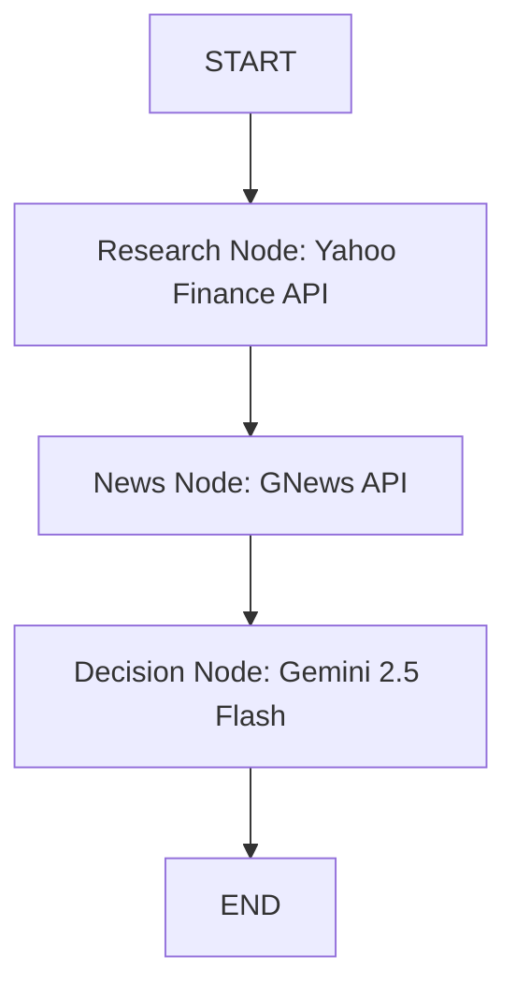

# InvestmentAI - AI Investment Research Agent

InvestmentAI is a premium, AI-powered stock analysis platform that performs autonomous financial research on public companies and decides whether to invest or pass. It uses LangGraph and Gemini to analyze stock market data, financial statements, and news sentiment, presenting professional reports and offering an interactive AI Investment Chatbot.

---

## 🚀 Overview

InvestmentAI empowers both guest users and registered users to make data-driven investment decisions.

### Features
1. **AI Investment Research Agent**: Fetches and evaluates financial summaries, balance sheets, statistics, and analyst ratings from Yahoo Finance, combines them with latest news articles, and runs a LangGraph decision agent to give a BUY/HOLD/SELL rating with SWOT analysis.
2. **Guest Mode**: Allows unregistered users to try out the search agent and chatbot. Enforces a limit of **5 free searches and 5 free chats per day** to protect resources.
3. **User Dashboard & History**: Registered users get a persistent dashboard showing their search history. Reports are saved in MongoDB, allowing instant loads without repeating API calls.
4. **AI Chatbot Assistant**: A floating, collapsible chat widget that is context-aware. If you are viewing a company report, the chatbot knows which company you are analyzing and helps answer questions (e.g. "What are their main risks?", "Explain their profit margin"). Guests get 5 chats, registered users get unlimited chats.

---

## 🛠️ How to Run It

### Prerequisites
- Node.js (v18 or higher)
- npm
- MongoDB URI (configured or use a local mongo instance)
- Google Gemini API Key

### Installation

1. **Clone or navigate to the project directory**:
   ```bash
   cd investment-ai
   ```

2. **Backend Setup**:
   ```bash
   cd server
   npm install
   ```
   Create a `.env` file in the `server` directory (one is already prepared for you with keys):
   ```env
   PORT=8000
   MONGO_URI=mongodb+srv://...
   JWT_SECRET=your_jwt_secret
   GOOGLE_API_KEY=your_gemini_api_key
   GNEWS_API_KEY=your_gnews_api_key
   ```
   Start the backend development server:
   ```bash
   npm run dev
   ```

3. **Frontend Setup**:
   ```bash
   cd ../client
   npm install
   ```
   Create a `.env` file in the `client` directory:
   ```env
   VITE_API_URL=http://localhost:8000/api/v1
   ```
   Start the frontend Vite server:
   ```bash
   npm run dev
   ```

4. Open `http://localhost:5173` in your browser.

---

## 🧠 How it Works - Approach & Architecture

The application is built on a modular MERN stack using a sequential agent graph:



1. **Research Node (Yahoo Finance)**: Fetches asset profile, pricing, financial data, and defaults/key statistics using the ticker symbol. Maps these raw details to a standardized payload.
2. **News Node (GNews)**: Searches for recent news articles matching the company name.
3. **Decision Node (Gemini 2.5 Flash)**: Executes a tailored system prompt. The model processes the parsed financial figures, statistics, and news summaries to produce a detailed recommendation JSON structure including confidence score, risk assessment, and a SWOT analysis.

---

## ⚖️ Key Decisions & Trade-Offs

- **Client-Side Guest Limits**: We chose to track guest daily counts (5 searches, 5 chats) using `localStorage` combined with a calendar-day reset check. This keeps the application stateless and light for unregistered users, bypassing complex guest session management in the DB.
- **Context-Aware Chatbot**: The chatbot sends the current stock analysis state (`companyContext`) along with messages. This provides immediate, context-aware chatbot help without persisting chat sessions in MongoDB, minimizing database load.
- **Caching Reports in DB**: Once a registered user triggers an analysis, the report is saved directly in the MongoDB `Investments` collection. When they return to it via their dashboard history, the app loads the saved report, saving valuable third-party API rate limits (GNews/Gemini).

---

## 📊 Example Runs - Agent Output

Below is an actual JSON output generated by the AI Investment Research Agent for **Apple Inc. (AAPL)**:

```json
{
  "recommendation": "BUY",
  "confidence": 85,
  "investmentScore": 80,
  "riskLevel": "Low",
  "marketSentiment": "Bullish",
  "timeHorizon": "Long Term",
  "summary": "Apple Inc. exhibits robust financial health with strong revenue, impressive margins, and substantial free cash flow, underpinning its market leadership in consumer electronics. Analyst sentiment is overwhelmingly positive, recommending a 'buy' with a high consensus score. While the current valuation, indicated by a high PE and PEG ratio, suggests the stock may be fully priced, its strong brand, expansive ecosystem, and consistent innovation provide a compelling long-term investment case. The company's large market capitalization and stable operations contribute to a low-risk profile.",
  "pros": [
    "Strong brand loyalty and global market presence.",
    "Excellent financial performance with high gross (47.86%) and profit (27.15%) margins.",
    "Substantial free cash flow ($101B) and operating cash flow ($140B).",
    "Diversified revenue streams across products and a growing services segment.",
    "Positive analyst sentiment with a strong 'buy' recommendation (score of 2 out of 5).",
    "Robust ecosystem driving recurring revenue and customer retention."
  ],
  "cons": [
    "High valuation (PE ratio of 32.81, PEG ratio of 2.55) suggests limited upside in the short term.",
    "Significant debt ($84.7B), though manageable with strong cash flow.",
    "Dependence on new product cycles and innovation for continued growth.",
    "Lack of recent news might indicate a period of consolidation or no immediate catalysts."
  ],
  "risks": [
    "Intense competition in all product categories (smartphones, services, wearables).",
    "Regulatory scrutiny regarding app store policies and market dominance.",
    "Potential for supply chain disruptions, particularly in manufacturing.",
    "Economic downturns impacting consumer spending on premium products.",
    "Potential for slowing growth due to market saturation and large size.",
    "Geopolitical tensions affecting global sales and production."
  ],
  "actionItems": [
    "Monitor quarterly earnings for growth in services revenue and new product adoption.",
    "Track competitive landscape and innovation from rivals.",
    "Evaluate valuation multiples against industry peers and historical averages.",
    "Assess impact of regulatory changes on business model.",
    "Watch for announcements regarding new product categories or market expansions."
  ],
  "swot": {
    "strengths": [
      "Global brand recognition and strong customer loyalty.",
      "Robust ecosystem (hardware, software, services) driving retention.",
      "High profitability and strong cash generation capabilities.",
      "Innovation capabilities and R&D investments.",
      "Efficient supply chain management."
    ],
    "weaknesses": [
      "High valuation multiples (PE, PEG).",
      "Significant debt load.",
      "Potential for slowing growth due to market saturation and large size.",
      "Dependence on iPhone sales, despite diversification efforts."
    ],
    "opportunities": [
      "Expansion into new product categories (e.g., AR/VR, automotive).",
      "Continued growth in the high-margin services segment.",
      "Penetration into emerging markets.",
      "Leveraging AI and machine learning across its ecosystem."
    ],
    "threats": [
      "Intense competition from other tech giants.",
      "Regulatory challenges and antitrust concerns globally.",
      "Supply chain vulnerabilities and geopolitical risks.",
      "Global economic slowdowns impacting consumer discretionary spending.",
      "Intellectual property infringement risks and litigation."
    ]
  }
}
```

---

## 🔮 What we would improve with more time

- **IP-Based Backend Rate Limiting**: Complement the frontend guest limits with backend rate-limiting middleware (using Redis or express-rate-limit) to prevent direct API abuse.
- **Multiple Agent Consensus**: Let multiple Gemini agents (e.g. Fundamental Analyst, Technical Analyst, Risk Analyst) debate and build a consensus rating instead of relying on a single prompt.
- **Chat History Logging**: Save authenticated users' chat conversations in the database so they can resume their discussions later.
